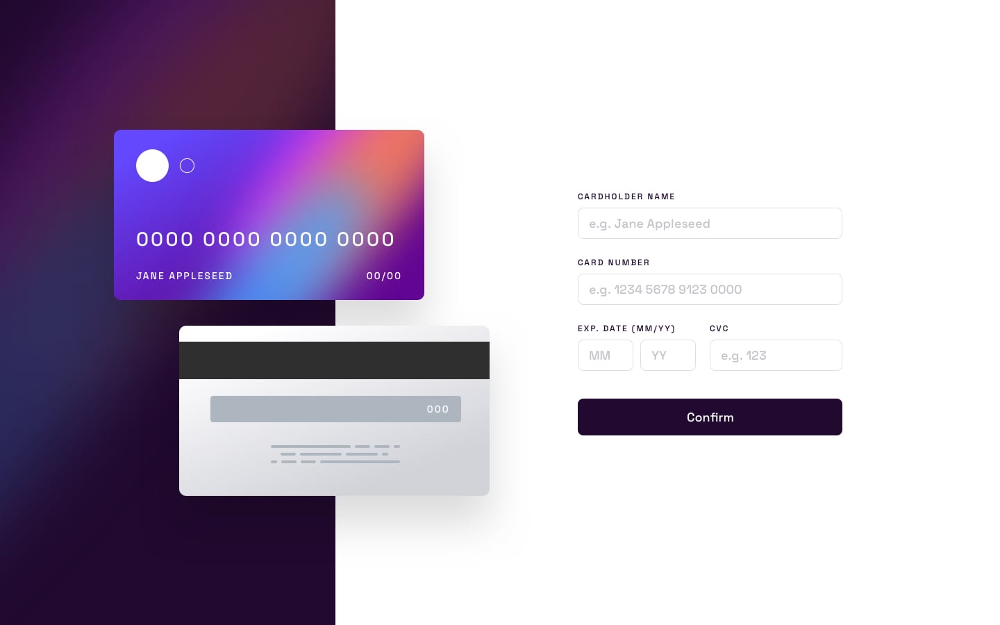

# Interactive Card Details Form

## Overview

This project is an interactive credit card form built to practice advanced form validation, real-time UI updates, and responsive layout design using pure HTML, CSS, and JavaScript.

The form allows users to enter card details while the card preview updates dynamically in real time. A strong validation layer ensures that all inputs follow the correct format before submission.

### Screenshot

### Links

- 🌐 Live Site: https://eng-mohamedhosny.github.io/interactive-card-details-form/
- 💻 Repository: https://github.com/Eng-MohamedHosny/interactive-card-details-form

---

## 🚀 Features

### 💳 Live Card Preview

The card preview updates instantly as the user types.

It dynamically reflects:

- Cardholder name
- Card number
- Expiration date
- CVC

This creates a more realistic and interactive user experience.

---

### ✅ Strong Validation System

The form includes a powerful validation layer that ensures all fields are correctly formatted before submission.

Validation includes:

- Required field validation
- Card number length validation
- Numeric-only validation for number fields
- Expiration date format validation
- CVC validation

Error messages are displayed directly under the corresponding fields.

---

### 🎨 Dynamic UI Feedback

The interface responds to user input in real time:

- Error states are applied automatically
- Invalid fields are highlighted
- Error messages appear instantly
- Inputs update the card preview dynamically

This improves usability and provides clear feedback.

---

### 📱 Fully Responsive Design

The layout adapts smoothly across different screen sizes including:

- Mobile
- Tablet
- Desktop

The design maintains a clean and balanced layout across all devices.

---

## 🛠️ Built With

- HTML5
- CSS3
- JavaScript (Vanilla JS)

No frameworks or libraries were used in this project.

---

## 👤 Author

- GitHub: [Eng-MohamedHosny](https://github.com/Eng-MohamedHosny)
- Frontend Mentor: [Eng-Mohamed Hosny](https://www.frontendmentor.io/profile/Eng-MohamedHosny)
